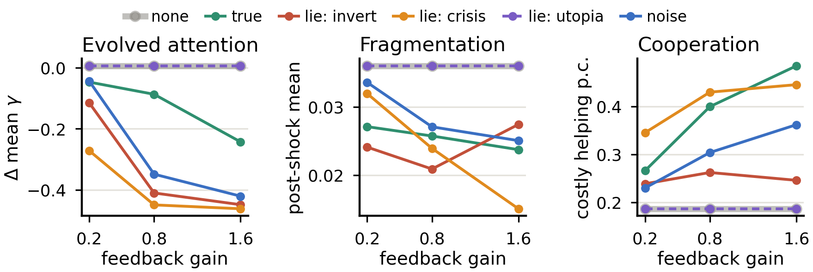
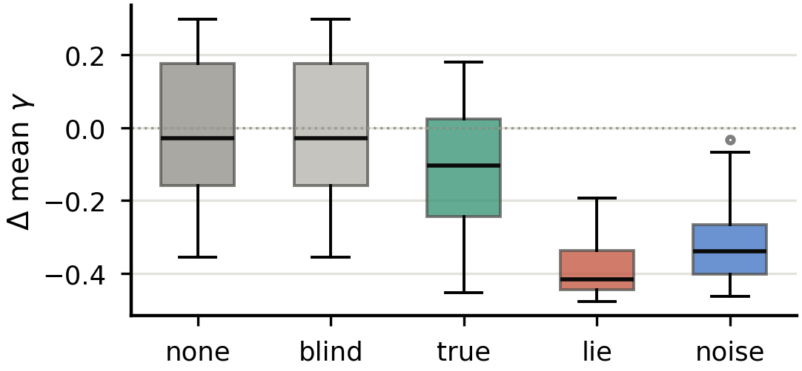

# Project ONE

**What happens to a population of agents when it is told its own collective state — and what happens when that description is false?**



Project ONE is a controlled, fully reproducible laboratory for *recursive self-model feedback* in evolving multi-agent networks. Temporary agents are born, cooperate, compete, reproduce and die, forming an adaptive network G(t). A global observer periodically compresses the macrostate — fragmentation, degree concentration, cooperation, inequality, turnover — into a self-model S(t) and, depending on the experimental condition, broadcasts it back to the agents **accurately, systematically falsified, replayed from another run, or as matched-range random noise**:

```
local actions → global condition → measurement → self-model → broadcast → changed local actions
```

Each agent carries a heritable *global sensitivity* trait γ that scales how strongly the broadcast moves its action propensities. Nothing in the rules refers to whether the broadcast is true.

## Headline findings

Evidence base: **927 core runs + 1,000 architectural-control runs + 1,200 ecology-ensemble runs = 3,127** (as reported in the manuscript), all deterministic and paired by seed. Four outcome families were pre-specified before the first campaign; everything else is labelled exploratory.

**Measurement alone is causally inert.** The observed-but-blind condition is trajectory-identical to no-observer under paired seeds — every per-seed difference exactly zero, on every outcome, twice replicated. Only the *broadcast* has causal power. (The engine computes S(t) under the no-feedback baseline too, for logging, so this doubles as a strict observer-side-effect invariance check.)

**Apparent "story pull" is an artifact — and that is the methodological finding.** A natural self-fulfilling-prophecy statistic registers strong, replicated apparent attraction of the macrostate toward false and replayed self-models (raw hierarchy: replay > inverted lie > noise). But a passive counterfactual — scoring *untreated* paired-seed twins against matched reference signals — fully accounts for it. Untreated worlds "move toward" the references **more** than treated worlds do (passive medians 0.012 / 0.030 / 0.007 vs actual 0.008 / 0.024 / 0.001), the per-condition gap ΔP = P_actual − P_passive is uniformly negative, and adjusted between-condition contrasts are null in both campaigns (F vs N: p = 0.084 harsh, p = 0.63 flagship). There is no evidence of content-specific attraction toward broadcast content. A three-line mean-reversion argument shows why this class of directional metric can read positive with zero causal feedback. Direct caution for empirical performativity claims — [`scripts/passive_null_checks.py`](scripts/passive_null_checks.py).

**What broadcasts do change is behavior and structure, and the lie–response pair decides which lies come true.** Under corrective agents an alarmist lie is self-defeating and a flattering lie is behaviorally inert; false and noise broadcasts densify the network and reduce hub concentration (the densification arm under *truthful* feedback is the one claim the ecology ensemble does not sustain — see below). Under conformist agents the taxonomy flips: the alarmist lie becomes catastrophically self-fulfilling (fragmentation ×10), the flattering lie becomes benevolently self-fulfilling, and even noise mobilizes cooperation. Formally, self-fulfillment is a property of the composition R∘B (response rule ∘ broadcast map), not of the message alone. First-order response *directions* follow from the rules by construction and are not claimed as discoveries.

**Truthful feedback doubles costly cooperation** — 0.397 vs 0.179 baseline (paired Δmedian +0.200, r = 1.00), monotone in gain, replicated under harsh shock and at 2× scale. And one pre-specified null, twice replicated: no feedback effect on post-shock recovery time in either main campaign, in any condition, even at 40% hub removal (every paired Δmedian exactly 0, all p > 0.22). One contrary lead is reported rather than buried — at 2× scale the inverted lie delayed recovery in every non-tied pair (+10 steps, r = 1.00), but with n = 8 that is the smallest p the test can return (0.0625) and it does not replicate at base scale.

**Attention to the self-model declines under consequential broadcasts.** γ is heritable and mutated; its population mean falls across ~20 generations of lineage depth, ordered false > noise > truth > silence, with a clean dose-response in feedback gain. Nobody programmed that ordering — and unlike models where agents update trust from observed accuracy, here nothing references reliability: **trust is not updated, it evolves.**



Two follow-ups keep that result honest:

- *What organizes it.* Veracity alone does not — the utopia lie is false yet produces no decline, while truthful feedback declines at high gain. The categorical ordering compresses into one relationship with the **broadcast-implied corrective-drive intensity** I = g·⟨Σ f_a(b)⟩ (Spearman ρ = −0.99 across 15 sweep cells, −0.83 at run level). This is **descriptive, not causal mediation**: I omits the per-agent factor γ and is computed from already-feedback-affected trajectories — [`scripts/attention_cost.py`](scripts/attention_cost.py).
- *What it is not.* Two asymmetries in the architecture could in principle manufacture the pattern, and each was rerun as its own 300-run sweep — [`scripts/reproduction_neutral_check.py`](scripts/reproduction_neutral_check.py). **(a) Reproductive opportunity.** Feedback adds weight only to non-reproductive actions, so after normalization a higher-γ agent mechanically has a lower probability of *selecting* reproduce — and I is exactly the quantity governing that penalty. A reproduction-neutral variant holding that selection probability exactly invariant (verified spread 0.00000 across γ) reproduces the decline almost perfectly: **median retention 98%**, no cell shifting significantly, ρ = −0.98 persisting, and truth declining *more* under the control. **(b) γ-in-pruning.** Hub-targeted pruning fires with probability γ_i rather than γ_i·g — a second, differently scaled channel acting straight on structure. Fixing it at 0.5 for every agent: **median retention 100%**, and the intensity correlation *strengthens* (ρ = −0.993 → −1.000); one cell of fifteen shifts significantly (N@g0.8, p = 0.033), an attenuation that still retains 77%. Selection on γ is ecological, not an artifact of either channel. **(c) The rule form itself.** Swapping the entire response function for the structurally unrelated conformist mapping, γ̄ still falls in every broadcast condition (paired Δmedian −0.14 to −0.57, all p ≤ 0.022) — so the *phenomenon* is not an artifact of the corrective rule form, the single most-repeated criticism of this work. Reported with its negative half: the *ordering*, and the I that summarises it, do not transfer across regimes (ρ = +0.10, p = 0.87) — [`scripts/rule_form_check.py`](scripts/rule_form_check.py). **(d) γ as the only exit.** (a)–(c) all keep the response mapping fixed, so lowering γ stays the only way to disengage. Making the polarity and strength ρ ∈ [−2,2] of each action channel heritable — ρ = 1 reproducing the hand-written rule *bit-identically*, ρ = 0 ignoring it, ρ < 0 reversing it — opens a second route, and γ̄ still declines (vs A, n = 100: C −0.125, F −0.222, N −0.212; all p < 1e-5). Freeing ρ attenuates the decline under false and noise feedback but not under truth, so populations use both routes exactly where disengagement pays — [`scripts/policy_campaign.py`](scripts/policy_campaign.py).

Full statistics and caveats: [`campaigns/FINDINGS.md`](campaigns/FINDINGS.md).

## Experimental design

| Condition | Observer | Agents receive | Role |
|---|---|---|---|
| A — Local only | off | nothing | baseline |
| B — Observed, blind | on | nothing | measurement control |
| C — True feedback | on | accurate S(t) | main treatment |
| F — False feedback | on | distorted S(t): invert / crisis / utopia | reflexivity probe |
| N — Noise feedback | on | uniform random, matched ranges | stimulation control |
| R — Replayed self-model | on | another run's genuine S(t) | structure control |

**Ecological robustness — 1,200 further runs.** The standing objection to this
work is that it lives in one ecology. Answered with a pre-registered randomized
ensemble: 24 ecologies drawn by perturbing six ecological parameters ±25%
(resource inflow, capacity, reproduction cost, metabolism, link cost,
mortality), screened for viability using **only the no-broadcast baseline and
criteria frozen before any broadcast condition ran** — so no ecology could be
admitted or dropped for showing the desired result. All 24 passed, with room to
spare. Then A/B/C/F/N × 10 paired seeds in each.

The three central results replicate in **every ecology**: cooperation up under
truth (24/24, median +0.184), attention falling under the lie (24/24, −0.396)
and under noise (24/24, −0.258), and the observed-but-blind identity (24/24,
every per-seed difference exactly zero). The pre-specified recovery null holds
in 24/24 for F and N and 22/24 for C. The dose-ordering **F ≤ N ≤ C ≤ A** holds
exactly in **21/24**, median rank correlation +1.00.

One claim does not survive, and is reported rather than dropped: **densification
under *truthful* feedback** is significant in 1 of 24 and correct-signed in 16,
against 24/24 on sign for both distortions — so the claim is *false and noise
broadcasts densify the network*, not *broadcasts densify the network*. Scope
stated plainly: ±25% gives per-ecology spreads of 2.5× in mean degree, 2.2× in
cooperation, 1.9× in population — evidence of *local* ecological robustness, not
of arbitrary-ecology generality — [`scripts/ecology_ensemble.py`](scripts/ecology_ensemble.py).

Multiplicity: over the eight point-p contrasts of the paper's Table 3, both Benjamini-Hochberg and the stricter Holm-Bonferroni correction leave every significance decision unchanged (6 of 8 either way). Enlarged to a deliberately hostile family of all **74** paired contrasts the paper reports, BH still leaves all eight unchanged; Holm demotes exactly one — fragmentation (flagship) F vs A, the weakest at p = 9.5e-4. Reported rather than scoped away — [`scripts/multiplicity_check.py`](scripts/multiplicity_check.py).

Paired seeds across conditions; standardized hub-removal shocks (10 hubs mild, top 40% harsh, at t = 2000 — t = 1500 in the 2× scale check); paired Wilcoxon signed-rank as the primary analysis with tie-corrected matched-pairs rank-biserial r and bootstrap CIs (Mann–Whitney U + Cliff's δ is a *secondary* view and does not agree everywhere — all inferential claims follow the paired analysis); passive-counterfactual nulls for the story-pull statistic; a dedicated signal-RNG stream so constructing the noise signal never advances the behavioral PRNG; robustness across feedback gains (0.2–1.6), two shock severities, 2× system scale, and two response regimes (corrective / conformist).

## Reproduce everything

```bash
pip install -r requirements-lock.txt              # exact versions used for the reported runs

python scripts/replay_check.py                    # seed-replay determinism, cross-platform
python scripts/validate_metrics.py                # observer metrics vs closed-form cases
python -m pytest tests/ -q                        # 13 tests: determinism, metrics, viability

python run.py --condition F --distortion invert --steps 2000 --seed 7
python scripts/dashboard.py runs/F_s7_n2000       # self-contained interactive dashboard
python scripts/demo.py                            # one-command live-demo kit
```

Campaigns and analyses (raw `runs/` are gitignored — either unpack the release
assets into `campaigns/`, or regenerate with the commands below):

```bash
# core campaigns
python scripts/campaign.py --seeds 50 --shock-step 2000 --out campaigns/flagship
python scripts/campaign.py --seeds 30 --shock-fraction 0.4 --out campaigns/harsh_shock
python scripts/replay_control.py                  # condition R + 15 source trajectories
python scripts/size_robustness.py                 # 2x scale check
python scripts/analyze_campaign.py campaigns/<name>

# architectural controls, 300 runs each (Sect. 5.5)
for G in 0.2 0.8 1.6; do python scripts/campaign.py --out campaigns/rn_g$G --seeds 20 \
  --steps 4000 --shock-step 2000 --gain $G --shock-fraction 0.4 \
  --conditions "C,F:invert,F:crisis,F:utopia,N" --reproduction-neutral; done
for G in 0.2 0.8 1.6; do python scripts/campaign.py --out campaigns/pgf_g$G --seeds 20 \
  --steps 4000 --shock-step 2000 --gain $G --shock-fraction 0.4 \
  --conditions "C,F:invert,F:crisis,F:utopia,N" --pruning-gamma-free; done

# analyses reported in the paper
python scripts/passive_null_checks.py             # passive counterfactual (Sect. 5.2)
python scripts/reproduction_neutral_check.py      # reproductive-opportunity control (Sect. 5.5)
PO_VARIANT=pgf python scripts/reproduction_neutral_check.py   # gamma-free-pruning control (Sect. 5.5)
python scripts/attention_cost.py                  # corrective-drive intensity vs evolved attention
python scripts/reviewer_checks.py                 # source-dependence, P>0, eps-sensitivity, activation
python scripts/config_model_null.py               # ER + degree-preserving clustering nulls
python scripts/multiplicity_check.py              # BH + Holm over the Table 3 contrasts
python scripts/rule_form_check.py                 # does the decline survive swapping the rule set?
python scripts/selection_mechanism.py             # what the gamma decline is NOT (fecundity, shock)
python scripts/sweep_figure.py campaigns/sweep_g0.2 campaigns/sweep_g0.8 campaigns/sweep_g1.6
python scripts/paper_figures.py                   # redraw Figs. 2-3 at printed size

# ecological robustness: 24 ecologies, viability frozen before any treatment ran
python scripts/ecology_ensemble.py --validate     # reproduces harsh_shock 16/16 to 1e-10
python scripts/ecology_ensemble.py --screen       # stage 1: baseline only, then STOP and read
python scripts/ecology_ensemble.py --run          # stage 2: treatments in the frozen viable set
python scripts/ecology_ensemble.py --merge        # fold multi-machine checkpoints, cross-check hashes
python scripts/ecology_ensemble.py --analyze      # stage 3: claims counted across ecologies
```

`--run` is resumable and splits across machines: each writes its own
checkpoint (`--checkpoint`) and reads every checkpoint present, so two
machines never repeat each other's work. Any run computed twice becomes a free
cross-platform check — `--merge` compares state hashes and refuses to merge on
disagreement. The reported 1,200-run ensemble was produced this way across
x86_64/Python 3.11/networkx 3.6.1 and aarch64/Python 3.10/networkx 3.4.2, with
31 overlapping runs agreeing bit-for-bit.

Every run is deterministic given (config, seed); state hashes verify replay across machines and operating systems. One PRNG drives all behavioral choices and a separate stream generates stochastic broadcast signals, so constructing the noise signal never advances the behavioral PRNG — with both control flags off the engine reproduces every stored campaign hash bit-for-bit.

## Paper

*A Network and Its Reflection: What True, False, and Noise Self-Model Broadcasts Do and Do Not Change in an Evolving Multi-Agent Network* — under submission to Complex Networks 2026. Sources and PDF in [`paper/`](paper/); research plan and original proposal in [`docs/`](docs/). The tag `cn2026-submission` marks the exact state the paper describes; every run regenerates deterministically from the pinned configuration and seed (see *Reproduce everything* above).

## Status

Active research. Criticism, replication attempts, and issues welcome — this project has already retracted one of its own headline results after a stronger control ([`passive_null_checks.py`](scripts/passive_null_checks.py)) showed it was explained by intrinsic dynamics, and retained another after two exact mechanistic controls ([`reproduction_neutral_check.py`](scripts/reproduction_neutral_check.py)) failed to remove it.

## License

MIT
