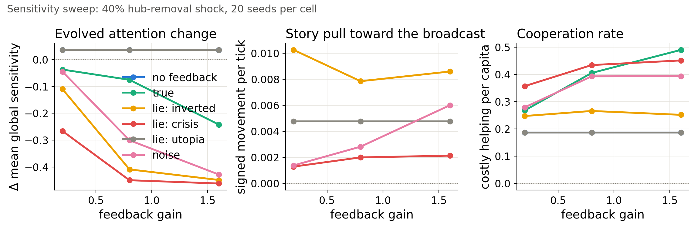
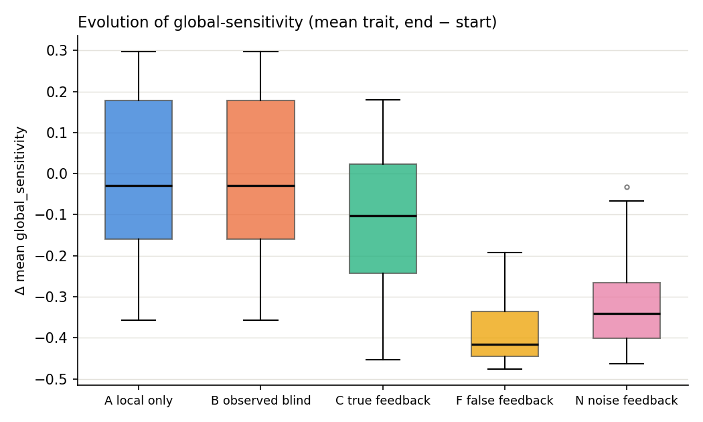

# Project ONE

**What happens to a population of agents when it is told its own collective state — and what happens when that description is false?**



Project ONE is a controlled, fully reproducible laboratory for *recursive self-model feedback* in evolving multi-agent networks. Temporary agents are born, cooperate, compete, reproduce and die, forming an adaptive network G(t). A global observer periodically compresses the macrostate — fragmentation, cooperation, centralization, inequality, turnover — into a self-model S(t) and, depending on the experimental condition, broadcasts it back to the agents **accurately, systematically falsified, or as matched-range random noise**:

```
local actions → global condition → measurement → self-model → broadcast → changed local actions
```

## Headline findings (927 runs, pre-specified outcome families)

**Measurement alone is causally inert.** The observed-but-blind condition is trajectory-identical to no-observer under paired seeds — Cliff's δ = 0.000 on every outcome, twice replicated. Only the *broadcast* has causal power.

**Apparent "story pull" is an artifact — and that is a finding.** A natural self-fulfilling-prophecy statistic registers strong, replicated apparent attraction of the macrostate toward false and replayed self-models (raw hierarchy replay > inverted lie > noise, r up to 1.00). But a passive counterfactual — scoring untreated paired-seed trajectories against the same reference signals — fully accounts for it: untreated worlds "move toward" the references MORE than treated worlds do (passive medians 0.012/0.030/0.007 vs actual 0.008/0.024/0.001), and adjusted between-condition contrasts are null in both campaigns. There is no evidence of content-specific attraction toward broadcast content. This is a direct caution for empirical performativity claims (`scripts/passive_null_checks.py`).

**What broadcasts DO change is behavior and structure — and which lies come true depends on how agents respond.** Under corrective agents, an alarmist lie is self-defeating and a flattering lie is behaviorally inert; broadcasts densify and decentralize the network. Under conformist agents the taxonomy flips: the alarmist lie becomes catastrophically self-fulfilling (fragmentation ×10), the flattering lie becomes benevolently self-fulfilling, and even noise mobilizes cooperation.

**Populations fed lies evolve to stop listening.** Attention to the broadcast is a heritable trait, and its population mean declines across generations — false (δ = −0.94) > noise > truth > silence, with a clean dose-response in feedback gain. The categorical ordering compresses into one continuous relationship: evolved attention strongly tracks the *broadcast-implied corrective-drive intensity* across the gain sweep (Spearman ρ = −0.99 over 15 cells; −0.83 at run level, n = 300). Nobody programmed that ordering; trust in the observer is not updated by any rule, it evolves. The individual-level pathway is not a simple fecundity gradient, and the intensity relationship is descriptive rather than causal mediation (see FINDINGS).



**Truthful feedback doubles costly cooperation** (δ = 0.96, monotone in gain) — the loop implements distributed corrective feedback. And one pre-specified null, twice replicated: we detected no evidence of a feedback effect on post-shock recovery time, even at 40% hub removal.

Full statistics: [`campaigns/FINDINGS.md`](campaigns/FINDINGS.md) · interactive explorer: `campaigns/flagship/report.html`

## Reproduce everything

```bash
pip install -r requirements.txt
python scripts/replay_check.py                   # exact seed-replay determinism (cross-platform)
python scripts/validate_metrics.py               # observer metrics vs. known closed-form cases
python run.py --condition F --distortion invert --steps 2000 --seed 7
python scripts/dashboard.py runs/F_s7_n2000      # self-contained interactive dashboard
python scripts/campaign.py --seeds 50 --shock-fraction 0.4 --out campaigns/replication
python scripts/analyze_campaign.py campaigns/replication
python scripts/demo.py                           # one-command live-demo kit
```

Every run is deterministic given (config, seed); state hashes verify replay across machines and operating systems. 13-test suite guards determinism, metric correctness, and population viability.

## Experimental design

| Condition | Observer | Agents receive |
|---|---|---|
| A — Local only | off | nothing |
| B — Observed, blind | on | nothing (placebo) |
| C — True feedback | on | accurate S(t) |
| F — False feedback | on | distorted S(t): invert / crisis / utopia |
| N — Noise feedback | on | matched-range random signal |
| R — Replayed self-model | on | genuine S(t) trajectory of another run |

Paired seeds across conditions; standardized hub-removal shocks; four pre-specified outcome families; paired Wilcoxon signed-rank primary analysis (Mann–Whitney U + Cliff's δ as robustness); passive-counterfactual nulls for the story-pull statistic; a dedicated signal-RNG stream, so constructing the noise signal never advances the behavioral PRNG; robustness across feedback gains (0.2–1.6), two shock severities, 2× system scale, and two response regimes (corrective / conformist).

## Paper

*A Network and Its Reflection: What True, False, and Noise Self-Model Broadcasts Do and Do Not Change in an Evolving Multi-Agent Network* — under submission to Complex Networks 2026. Draft and sources in [`paper/`](paper/). Research plan and the original proposal in [`docs/`](docs/).

## Status

Active research. Criticism, replication attempts, and issues welcome.

## License

MIT
